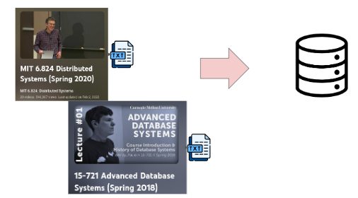
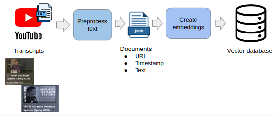
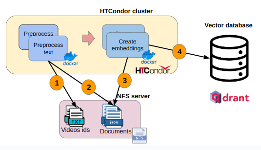
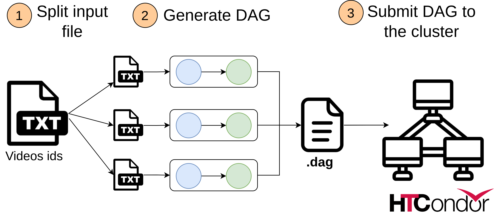

## Project Description

A distributed implementation of the ETL pipeline for vector database. Jobs are run in Docker containers on HTCondor cluster.

I take 2 video playlists from Youtube and load them into vector database.

## Pipeline overview

### Stage 1: Load and preprocess text 
Transcripts of the videos are fetched from Youtube. The obtained
transcripts are split into chunks. For each chunk a json object is created which contains a URL for the video, the text chunk and the timestamp.

### Stage 2: Create embeddings and load into vector database
The second stage takes the json document and creates vector embeddings for the text
chunks. Embeddings are created with the sentence transformer library. After embeddings
are created, they are loaded into the vector database together with the corresponding json objects.

## Distributed execution
To implement the distributed ETL pipeline I set up an HTCodor cluster. Shared file system (NFS) is utilized to store the intermediate job results and the initial input
files. 

1. Read input data (videos ids) from NFS and preprocess corresponding transcripts
2. Save result in json to NFS
3. Embeddings job read json files and create embeddings
4. Embeddings are loaded into vector database

## DAG generation

The input file is a .txt file with ids of the all the videos which should be processed and loaded into a vector db.

The `pipeline.py` script does the following:

- Split input data into smaller files
- Generate DAG to process smaller files
- Submit DAG to HTCondor cluster
  
The number of parallel pipelines can be configured and specified in the `config.ini` file.

## Configuration for NFS

Submission host and executors must have the same parameters in /etc/condor/condor_config:

UID_DOMAIN = ec2.internal

FILESYSTEM_DOMAIN = wqd7008 # can be anything, but should be the same 

